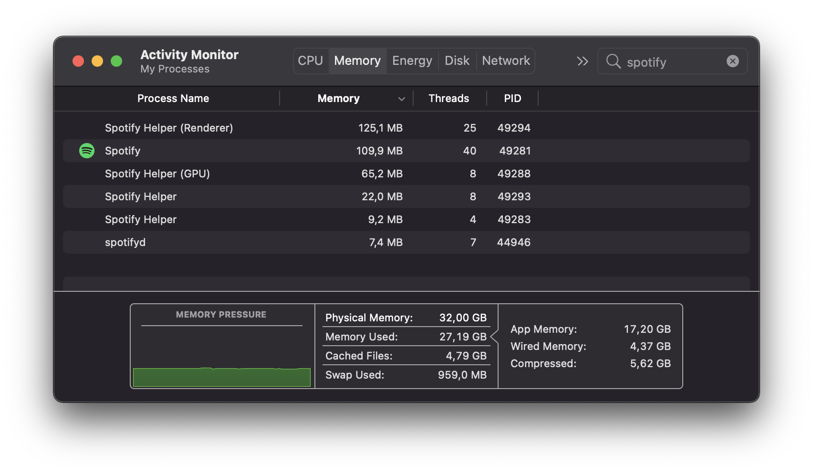
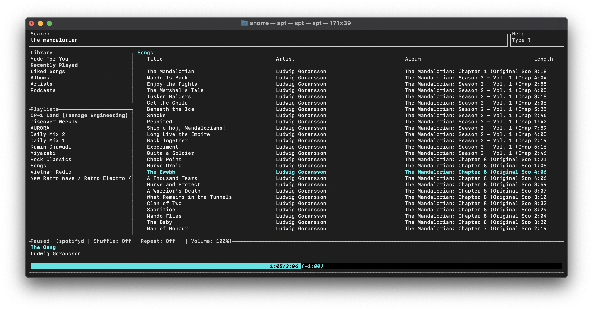

This post is for those of you subscribing to Spotify, the mega-popular streaming service.
Spotify as many companies before them have released multi-platform apps based on web technologies.
The desktop app is quite user friendly and pretty, but as it turns out it uses quite a lot of resources.
In this post we will see how the good old terminal user interface and a Rust-based daemon can help!

During a typical work day I will stream music for hours at a time, only being interrupted by video meetings and lunch.
For all those hours my Spotify app is barely open, mostly to skip songs I don't like.
For this measly work Spotify fires up five processed consuming more than 300MB of memory.
All of this just to mostly stay in the background and playing music. Below you see a screenshot of the processes and their memory consumption as reported by MacOS monitor:

I'm not trying to lampoon the Spotify client.
All things considered it is very nicely designed and very user friendly.
But if you don't have a lot of memory to go on and/or you don't really care about the album covers and nice design there is another option.
Enter [Spotifyd](https://github.com/Spotifyd/spotifyd):

> Spotifyd streams music just like the official client, but is more lightweight and supports more platforms. Spotifyd also supports the Spotify Connect protocol, which makes it show up as a device that can be controlled from the official clients.

Spotifyd when set up will allow you to stream music and can be controlled from the official clients (say the Spotify app on your phone) or even other clients with support for the spotify connect protocol.
It doesn't offer a UI of its own and only handles the streaming, playback, and any incoming Spotify connect calls.
It does however do this beautifully and with hardly any impact on your resources.
In my experience it consumes less than `10 MB` of memory and very little CPU.
Because it is designed to run in headless mode and consumes very little resources it could very well fit onto an original Raspberry Pi.

Now that you have the playback part of Spotify replaced you still might need a user interface.
Sure you can use your cellphone, but having to thumb or face-unlock your phone can get tiresome.
A good alternative is [spotify-tui](https://github.com/Rigellute/spotify-tui).

> A Spotify client for the terminal written in Rust.

Before grahical user interfaces (GUIs) there were terminal/text user interfaces (TUIs).
While GUIs have mostly displaced terminal user interfaces for consumer apps, TUIs still persist especially as code editors and configuration tools.
One big advantage of TUIs today are the fact that they run in your terminal and only output text.
This allows them to be quite lean as they only need to work with text output.
Gone are the embedded browser engines with giant DOM hierarchies, layout engines, etc.

My favorite thing about spotify-tui is the clean design.
There is no disturbing elements and you can use the q, arrow, and enter keys to do most of the navigation in the app.
There is support for themes, and you can configure things like the increment of the volume control, etc.
And as with the Spotifyd daemon the resource usage is marginal, consuming about `13 MB` of memory.

## Conclusion

Essentially you get the same listening experience with a little over `20 MB` of memory consumed by two lightweight processes as you do with `~300 MB` of memory spread over five more CPU intensive processes.
That is about an order of magnitude in difference.
If you're running Spotify on a more memory constrained machine and find yourself using all the memory you might consider using the Spotifyd and Spotify TUI combo.

Spotifyd also gives you the option of building your very own open-source Spotify listening device should you have the appropriate hardware laying about.

Lets hope Spotify does not do something to limit playback to first party clients and partners, because this setup is great!
